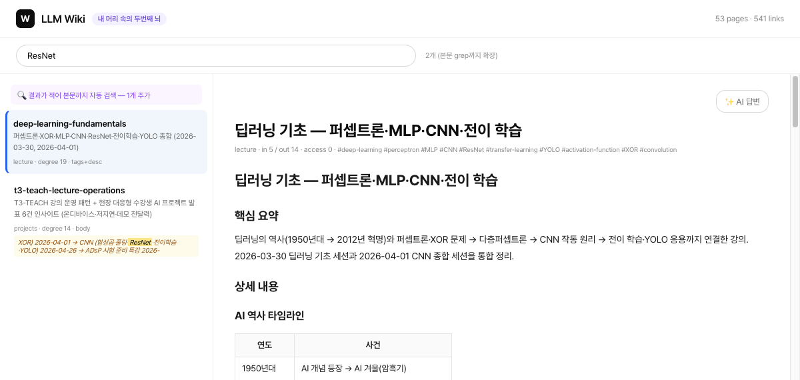
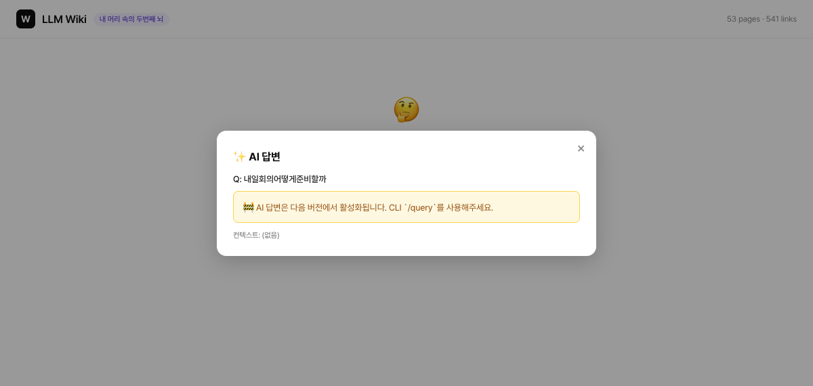

# llm-brain — 당신의 두 번째 뇌를 만드세요

> **LLM을 컴파일러로 쓰는 Second Brain 시스템**
> *Build your Second Brain with LLM as the compiler*


---

## 설치 *Install*

Claude Code 플러그인으로 설치한다:

```
/plugin marketplace add kimsanguine/llm-brain
/plugin install llm-brain@llm-brain
```

설치하면 컴파일러 커맨드가 추가된다 — `/llm-brain:ingest`·`/llm-brain:curate`·`/llm-brain:express`·`/llm-brain:query`·`/llm-brain:okf`.

> 자기 지식 데이터를 다루려면 레포를 클론해 `raw/` 소스를 등록한다(아래 [빠른 시작](#빠른-시작-quick-start)). 플러그인은 *컴파일러 커맨드*를, 클론은 *자기 데이터*를 제공한다.

---

## 미리보기 *Preview*

로컬 HTML 검색·페이지뷰 (`uv run python -m wiki_app`):

| 검색 + 페이지 뷰 | 본문 grep 자동 확장 |
|---|---|
|  |  |

| 결과 0개 → AI CTA | AI 답변 모달 (live) |
|---|---|
|  |  |

> 한국어/영문 검색 · 결과 < 3개일 때 본문 grep 자동 확장 · 페이지 뷰 + wikilink SPA 네비게이션 · AI 답변 옵션 토글

---

## 왜 만들었나 *Why this exists*

매일 TIL을 쓰고, 회의록을 남기고, 논문을 클리핑한다.
그런데 한 달 뒤 그 지식은 어디 있는가?

*You write TILs, meeting notes, paper clippings every day.*
*But where does that knowledge go after a month?*

---

## Andrej Karpathy의 LLM Wiki 패턴 *Karpathy's LLM Wiki Pattern*

Karpathy는 이 문제에 대해 명쾌한 답을 제시했다.

> **"LLM을 컴파일러처럼 써라. raw 메모를 넣으면 구조화된 위키가 나온다."**

```
raw/   →   [LLM 컴파일러]   →   wiki/
원본                              정제된 지식
```

### 장점 *Strengths*

| | 설명 |
|---|---|
| ✅ | **LLM이 구조화를 담당** — 사람이 직접 편집할 필요 없음 |
| ✅ | **raw / wiki 분리** — 원본은 보존, 정제본은 별도 관리 |
| ✅ | **wikilink 연결** — 지식이 그래프로 연결됨 |
| ✅ | **오염 방지** — raw 없이 wiki 수정 금지 원칙으로 할루시네이션 차단 |

---

## 그러나 4가지가 빠져 있다 *But 4 things are missing*

LLM Wiki는 아이디어 수준에 머물렀다.
실제로 운영해보면 이 4가지 벽에 부딪힌다.

*LLM Wiki stays at the concept level. In practice, you hit 4 walls.*

| 한계 | 증상 |
|---|---|
| ❌ **Express 없음** | 지식이 wiki에 쌓이기만 한다. 꺼내 쓸 방법이 없다 |
| ❌ **Capture 필터 없음** | 뭐든 ingest하면 노이즈가 차오른다 |
| ❌ **단발성 압축** | 자주 쓰는 지식이 더 깊이 정제되지 않는다 |
| ❌ **그래프 맹목** | Obsidian에서 보이는 연결 구조를 curate에 활용하지 않는다 |

---

## Tiago Forte의 Second Brain *Tiago Forte's Second Brain*

Forte는 같은 문제를 다른 각도에서 풀었다.

> **"뇌는 아이디어를 떠올리는 곳이지, 저장하는 곳이 아니다."**
> *"Your brain is for having ideas, not storing them."*

그의 **CODE 프레임워크**는 지식의 전체 생애주기를 다룬다.

```
C apture  →  O rganize  →  D istill  →  E xpress
  수집           정리           정제          출력
```

Second Brain의 핵심은 **Distill과 Express**다.
자주 꺼내볼수록 더 압축되고, 결국 창작물로 나와야 한다.

그러나 이 두 단계는 **사람이 직접** 해야 했다. 시간이 가장 많이 드는 곳이다.

---

## llm-brain = LLM Wiki + Second Brain

두 패턴의 결합이 이 프로젝트다.

*This project is the synthesis of both patterns.*

```
         LLM Wiki          +        Second Brain
    ─────────────────────────────────────────────
    raw → wiki 컴파일       +    CODE 전체 생애주기
    할루시네이션 방지         +    Distill → LLM 대행
    wikilink 그래프          +    Express → 창작물 출력
                             +    lifecycle → TTL 관리
```

**Distill은 LLM이 대행한다. 당신은 Express에만 집중하라.**

*LLM handles Distill. You focus only on Express.*

---

## 핵심 기능 *Core Features*

### 📥 ingest — 4가지 입력 채널 *4 Input Channels*

```bash
# 채널 1: 수동 투입 (MD · TXT · PDF · DOCX · PPTX)
cp paper.pdf raw/docs/

# 채널 2: /llm-brain:ingest 슬래시 명령 (Claude Code 세션 내에서만 동작)
/llm-brain:ingest https://example.com --resonance high
/llm-brain:ingest ~/Downloads/paper.pdf
/llm-brain:ingest "오늘 배운 것: ..."

# 채널 3: Obsidian vault 자동 미러링 (schema/sources.yaml 등록)
# 채널 4: Claude Code Routines 크론 등록
```

`--resonance high/medium/low` 태그로 중요도 표시.
index.md 기반 중복 검사로 wiki 노이즈 방지.

---

### 🔁 curate — 점진적 압축 + 그래프 분석 *Progressive Summarization + Graph*

```
/llm-brain:curate --distill     # distill_level 점진 압축
/llm-brain:curate --lifecycle   # TTL 초과 페이지 → archive 후보
/llm-brain:curate --all         # 전체 실행 (audit + distill + lifecycle)
```

> wikilink 그래프(`wiki/graph.json`)는 `curate`·`wiki_app`이 내부적으로 생성한다.

wiki 페이지는 접근할수록 더 깊이 정제된다.

```yaml
# curate --distill이 관리하는 frontmatter 필드
distill_level: 2      # 0=원문 → 1=요약 → 2=핵심 → 3=한줄
access_count: 12      # 웹 페이지뷰(wiki_app)는 frontmatter와 wiki_stats.json 둘 다 갱신
                      # CLI curate --record-access는 wiki_stats.json만 갱신
```

> `access_count`의 실제 집계는 `wiki_stats.json` 사이드카가 정본이다. `distill` 실행 시 frontmatter 값과 `wiki_stats.json` 값 중 큰 값으로 동기화된다.

> wiki 페이지는 이 외에 Agent Memory OS의 optional 필드(`memory_type`, `retention`, `confidence`, `source_count`, `last_verified`, `decay_policy`)를 선언할 수 있다. 전부 선택이라 없어도 기존 페이지는 그대로 유효하다. (상세: `SPEC.md`)

`export_graph.py`는 `[[wikilink]]` 인바운드 수를 분석해 `wiki/graph.json`을 생성한다.
허브·고립 페이지 판단은 `wiki_app`의 `/api/page/{slug}/graph` 엔드포인트로 조회 가능하다.

---

### 📤 express — wiki → 창작물 *Wiki to Output*

Second Brain의 존재 이유. 지식을 꺼내 쓴다.

*The reason Second Brain exists. Get knowledge out.*

```
/llm-brain:express blog "AI 에이전트 설계 패턴"
/llm-brain:express lecture "context-first-orchestration" --slides 5
/llm-brain:express summary --week
/llm-brain:express report "경쟁사 현황"
```

blog 출력은 `raw/blog/`에도 자동 복사 → 다음 ingest 사이클에 wiki로 피드백.

```
wiki/ → express/blog/ → raw/blog/ → wiki/   ← 피드백 루프
```

---

### 🔍 query — wiki 기반 답변 *Wiki-grounded Answers*

```
사용자: "RAG 구현할 때 뭐가 중요했지?"
Claude: wiki/ 내용 기반으로만 답변
        (wiki에 없으면 "raw 데이터가 필요합니다")
```

query 시 접근한 페이지의 `access_count`가 올라가
다음 `curate --distill`에서 자동 우선 처리된다.

### 🌐 wiki-web — HTML 검색·페이지뷰 인터페이스 *Local HTML Search UI*

CLI `/llm-brain:query`의 시각화 버전. 브라우저에서 검색·페이지 탐색·wikilink 클릭.

```bash
uv run python -m wiki_app
# → http://localhost:8000
```

- **검색**: 제목 + description + tags + page_title 점수 매칭, 결과 < 3개일 때 본문 grep 자동 확장
- **페이지뷰**: 마크다운 렌더링 + `[[wikilink]]` 클릭 SPA 네비게이션, 좌측 결과 리스트 유지
- **AI 답변 토글**: 결과 부족도에 비례해 CTA 강조 차등 (작은 버튼 / 노란 박스 / 큰 검정 버튼)
- **URL hash**: `#q=...&page=...` 형태로 검색·페이지 상태 보존, 새로고침 시 복원

스크린샷: `docs/screenshots/dod-*.png`

> AI 답변은 `claude -p` CLI로 라이브 동작 (2026-05-23 연결, 05-26 SSE 스트리밍 추가). Claude Code 미설치 시 `status: unavailable`로 graceful 처리.

---

### 📦 okf — wiki → OKF 호환 번들 *Wiki to OKF Bundle*

`wiki/`(내부 슈퍼셋)를 OKF v0.1(Google Open Knowledge Format) 호환 번들 `okf/`로 투영한다. 동료·외부 에이전트·habix 제품이 번역 없이 그대로 소비할 수 있는 표준 포맷으로 내보내, llm-brain을 경쟁 포맷이 아니라 OKF 표준을 흡수하는 export 포트로 만든다.

내부 포맷은 바꾸지 않고 경계(`okf/`)에서만 변환한다. frontmatter는 OKF 예약 필드로 매핑하고 나머지 내부 필드는 `x-llmbrain-*`로 보존하며, 본문 `[[wikilink]]`는 번들 루트 절대경로 마크다운 링크(`[X](/concepts/x.md)`)로 변환한다.

```
/llm-brain:okf                  # 먼저 dry-run 검토 후 okf/ 번들 생성
/llm-brain:okf --dry-run        # export 대상·제외·통계만 (파일 미작성, 보안 검토용)
/llm-brain:okf --strip-internal # 외부 공유본 (OKF 예약 6필드만, x-llmbrain-* 제거)
```

> 슬래시 커맨드 `commands/okf.md`가 내부적으로 `scripts/okf_export.py`를 실행한다.

**제외/민감 설정 (보안):**
- 경로 제외(`business/**`·`canvas/**`)는 커밋되는 `schema/okf_export.yaml`의 `exclude_paths`.
- 🔴 **민감 키워드(`sensitive_patterns`, 본문 평문 스캐너)·민감 페이지(`exclude_slugs`)는 gitignored `schema/okf_export.local.yaml`에만 둔다** — 커밋되는 yaml에 실명·내부명을 넣으면 그 자체가 누출.

> ⚠ `okf/`는 Git 커밋·push되면 history가 영구(비가역)다. **public 커밋 전 `--dry-run`으로 ① `business/` 제외 ② `sensitive_hits=0` ③ `excluded` 카운트=기대값을 사람이 확인**한다. fresh clone/CI엔 `okf_export.local.yaml`이 없어 게이트가 비활성(stderr 🔴 경고) — 그 상태로 커밋 금지.

---

### 🧠 Agent Memory OS — 5층 기억 *5-Layer Memory*

지금까지의 `wiki/`는 **의미 기억(semantic)** — "무엇을 아는가"만 담는다. Agent Memory OS는 여기에 **에피소드·절차·작업기억·메타** 4개 층을 더해, 한 번의 실행이 다음 실행을 더 똑똑하게 만드는 되먹임 루프를 완성한다.

*`wiki/` is semantic memory ("what you know"). Memory OS adds episodic · procedural · working · meta layers so each run makes the next one smarter.*

```
작업기억(읽기) → 실행(ingest·express·query·curate) → 에피소드(쓰기) → 메타(건강 진단) → 더 나은 작업기억
```

새로 얻는 것 *What you gain*:

| 기능 | 설명 |
|---|---|
| 📒 **episode 자동 기록** | `ingest`·`express`·`query` 실행이 `episodes/YYYY-MM.jsonl`에 운영 이력으로 남는다 (fail-soft — 기록이 실패해도 본 작업은 안 멈춤 · gitignored 사적 데이터) |
| 🧩 **brain_context** | 작업 직전 "작업기억 팩"(관련 semantic + 최근 episode + 후보 procedure + 제약)을 결정적 순서로 한 번에 조립 |
| 🩺 **memory_health** | 읽기전용 메모리 건강 리포트 — wiki 페이지는 건드리지 않고 리포트(`wiki/memory_health_report.md`)만 쓴다 |
| 🔁 **procedures/** | 재사용 절차(워크플로우) 메모리 (예: `ingest`·`express-blog`·`okf-export-safety`) |
| 🏷️ **memory_type** | 페이지의 메모리 역할(`semantic`·`episodic`·`procedural`·`meta`·`working`)을 선언하는 frontmatter 필드 (선택) |

바로 써보기 *Try it*:

```bash
# 작업 직전 "작업기억 팩" 생성 (관련 페이지 + 최근 이력 + 절차 + 제약)
uv run python scripts/brain_context.py --task "RAG 블로그 초안" --topic "rag retrieval" --type express

# 읽기전용 메모리 건강 리포트 → wiki/memory_health_report.md
uv run python scripts/memory_health.py --report
```

> 전부 **optional 레이어**다 — 이 명령들을 한 번도 안 써도 `ingest`·`curate`·`express`·`query`는 그대로 동작한다. 상세 스펙: `SPEC.md`의 "Agent Memory OS" 절.

---

## LLM 엔진 선택 *LLM Engine*

```yaml
# schema/config.yaml
llm:
  engine: cli   # Claude Code CLI 재사용 — API 키 불필요
  # engine: api # Anthropic API 직접 호출
```

| 모드 | 비용 | 조건 |
|---|---|---|
| `cli` (기본) | 토큰 비용 없음 | Claude Code 설치 필요 |
| `api` | API 과금 | `ANTHROPIC_API_KEY` 필요 |

---

## 빠른 시작 *Quick Start*

[설치](#설치-install)로 커맨드를 받은 뒤, 자기 지식 데이터로 운영하려면 레포를 클론한다:

```bash
git clone https://github.com/kimsanguine/llm-brain.git && cd llm-brain
```

그다음 Claude Code 세션에서 슬래시 커맨드로 운영한다:

```
1. schema/sources.yaml 에 raw/ 위치 등록
2. /llm-brain:ingest          # raw → wiki 컴파일
3. /llm-brain:query "..."     # wiki 기반 질의
4. /llm-brain:express blog "..."   # 창작물 출력
```

데모 시드로 즉시 체험(선택):

```bash
cp index.md index.md.bak 2>/dev/null || true   # 작성자 index 백업
cp -r examples/seed-wiki/wiki ./wiki            # 데모 wiki 선별 복사
cp examples/seed-wiki/index.md ./index.md
uv run python -m wiki_app                       # 로컬 HTML UI → localhost:8000
```

Obsidian으로 열려면 이 폴더를 "Open folder as vault".

---

## Obsidian 연동 *Obsidian Integration*

`.obsidian/`(기본 설정)이 프로젝트 루트에 있어 이 폴더를 Obsidian vault로 바로 열 수 있다. `raw/`·`wiki/`가 vault에 포함되어 Graph View로 탐색 가능하다. *(개인 graph 레이아웃·플러그인 상태는 gitignore라 클론 환경에서 동일하게 재현되진 않는다.)*

```
llm-brain/
├── .obsidian/   ← vault root
├── raw/         ← Graph View 표시
└── wiki/        ← Graph View 표시
```

---

## 디렉토리 구조 *Directory Structure*

```
llm-brain/
├── .claude-plugin/            # 플러그인 manifest (marketplace.json + plugin.json)
├── commands/                  # 슬래시 커맨드 (/llm-brain:ingest·curate·express·query·okf)
├── CLAUDE.md                  # Claude Code 운영 가이드
├── SPEC.md                    # 기술 명세서
├── README.md
├── pyproject.toml
├── schema/
│   ├── sources.example.yaml   # 소스 설정 템플릿
│   ├── config.yaml            # LLM 엔진 선택
│   ├── ingest.md              # ingest 규칙
│   ├── curate.md              # curate 규칙
│   ├── okf.md                 # OKF ↔ llm-brain 매핑 규칙
│   └── okf_export.yaml        # /llm-brain:okf 제외 설정 (exclude_paths)
├── scripts/
│   ├── setup.sh               # 초기 설정
│   ├── sync_raw.py            # 소스 미러링
│   ├── ingest.py              # 파일 파싱 + 상태 관리
│   ├── curate.py              # 감사·압축·lifecycle (--health, --suggest-bridges)
│   ├── export_graph.py        # wikilink 그래프 export → wiki/graph.json
│   ├── okf_export.py          # wiki → OKF v0.1 호환 번들 okf/ export
│   ├── express.py             # wiki → 창작물 출력
│   ├── episode.py             # 🧠 append-only 에피소드 원장 (episodes/YYYY-MM.jsonl)
│   ├── brain_context.py       # 🧠 작업기억 팩 조립 (semantic+episode+procedure+제약)
│   ├── procedures.py          # 🧠 재사용 절차 메모리 로더
│   └── memory_health.py       # 🧠 읽기전용 메모리 건강 리포트
├── wiki_app/                  # 🌐 HTML 검색·페이지뷰 (FastAPI)
│   ├── api.py                 # 6 endpoints
│   ├── search.py              # 검색 인덱스 + B/C 알고리즘
│   ├── pages.py               # 페이지 로더
│   ├── render.py              # markdown + wikilink 변환
│   ├── access.py              # access_count wrapper
│   └── static/                # vanilla JS + CSS + HTML
├── tools/
│   └── intro-video/           # Remotion 소개 영상
├── raw/                       # 원본 소스 (.gitignore)
├── wiki/                      # LLM 정제 결과 (.gitignore)
├── express/                   # 창작물 출력 (.gitignore)
├── episodes/                  # 🧠 에피소드 원장 YYYY-MM.jsonl (.gitignore · 사적)
├── procedures/                # 🧠 재사용 절차 메모리 (Git 커밋 대상)
└── okf/                       # OKF v0.1 호환 번들 (okf_export.py 생성, Git 커밋 대상)
```

---

## 패키지명 참고 *Package Name Note*

배포 패키지명은 `llm-wiki` (`pyproject.toml` name 필드), 제품·저장소명은 `llm-brain`이다. 두 이름이 혼용되지 않도록 주의: `uv sync`·`pip install` 시에는 `llm-wiki`, GitHub/Obsidian 참조 시에는 `llm-brain`을 사용한다.

---

## 의존성 *Dependencies*

```toml
pymupdf          # PDF 텍스트 추출
python-docx      # Word 문서 추출
python-pptx      # PowerPoint 추출
markdownify      # HTML → Markdown
httpx            # URL 스크랩
pyyaml           # 설정 파일 파싱
python-frontmatter  # MD frontmatter
anthropic        # API 모드 (선택)
```

---

## 라이선스 *License*

MIT © [kimsanguine](https://github.com/kimsanguine)
